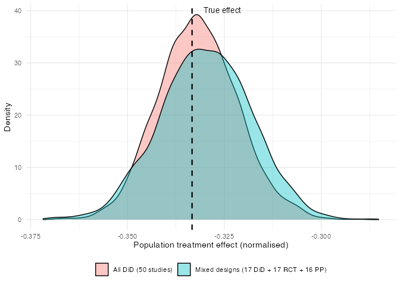

<!-- README.md is generated from README.Rmd. Please edit that file. -->

```{r setup, include = FALSE}
knitr::opts_chunk$set(
  collapse = TRUE,
  comment = "#>",
  fig.path = "man/figures/README-"
)
```

# metadid

[](https://github.com/ben18785/metadid/actions)
[](https://app.codecov.io/gh/ben18785/metadid)

**metadid** is an R package for Bayesian meta-analysis that synthesises treatment effects across studies with different designs: difference-in-differences (DiD), post-only randomised controlled trials (RCT), and pre-post studies. It uses a hierarchical Stan model that accounts for design-specific information and heterogeneity across studies, with optional baseline normalisation to place outcomes on a common fractional scale.

## Model assumptions

`metadid` assumes that all studies arise from a common latent difference-in-differences (DiD) structure. Different study designs correspond to observing different parts of this latent structure.

DiD studies are the only design in this framework that directly identify the treatment effect. Meta-analyses that do not include DiD studies are not identified from the data and depend entirely on modelling assumptions. We do not recommend using this approach in the absence of DiD evidence.

### Latent DiD model

For study \(i\), outcomes in the **control group** satisfy

\[
\begin{pmatrix}
Y_{i,c,\mathrm{pre}} \\
Y_{i,c,\mathrm{post}}
\end{pmatrix}
\sim
\mathcal{N}
\left[
\begin{pmatrix}
\alpha_i \\
\alpha_i + \beta_i
\end{pmatrix}
,
\begin{pmatrix}
\sigma^2_{i,c,\mathrm{pre}} &
\rho_{i,c}\sigma_{i,c,\mathrm{pre}}\sigma_{i,c,\mathrm{post}} \\
\rho_{i,c}\sigma_{i,c,\mathrm{pre}}\sigma_{i,c,\mathrm{post}} &
\sigma^2_{i,c,\mathrm{post}}
\end{pmatrix}
\right],
\]

and outcomes in the **treatment group** satisfy

\[
\begin{pmatrix}
Y_{i,t,\mathrm{pre}} \\
Y_{i,t,\mathrm{post}}
\end{pmatrix}
\sim
\mathcal{N}
\left[
\begin{pmatrix}
\alpha_i + \gamma_i \\
\alpha_i + \gamma_i + \beta_i + \theta_i
\end{pmatrix}
,
\begin{pmatrix}
\sigma^2_{i,t,\mathrm{pre}} &
\rho_{i,t}\sigma_{i,t,\mathrm{pre}}\sigma_{i,t,\mathrm{post}} \\
\rho_{i,t}\sigma_{i,t,\mathrm{pre}}\sigma_{i,t,\mathrm{post}} &
\sigma^2_{i,t,\mathrm{post}}
\end{pmatrix}
\right].
\]

Here:

- \(\alpha_i\): baseline mean in the control group  
- \(\beta_i\): time trend shared across groups  
- \(\gamma_i\): baseline difference between treatment and control  
- \(\theta_i\): study-specific treatment effect  
- \(\rho_{i,c}\), \(\rho_{i,t}\): pre/post correlations  
- \(\sigma_{i,g,\mathrm{pre}}\), \(\sigma_{i,g,\mathrm{post}}\): marginal standard deviations  

The key identifying assumption is that, in the absence of treatment, the treatment group would have followed the same time trend \(\beta_i\) as the control group.

---

### Study designs as partial observations

Different study designs correspond to observing subsets of this latent structure:

- **DiD**: both groups and both time points observed  
- **RCT**: both groups, post-treatment only  
- **Pre-post**: treatment group only, both time points  
- **Change-score**: partial observations of differences  

Inference for incomplete designs relies on the shared latent structure across studies.

---

### Hierarchical treatment effects

Study-specific treatment effects are modelled hierarchically, for example as

\[
\theta_i \sim \mathcal{N}(\mu_\theta, \tau_\theta^2),
\]

where \(\mu_\theta\) is the overall treatment effect and \(\tau_\theta\) captures between-study heterogeneity.

For robustness to outlying study effects, the model can alternatively use a Student-t distribution,

\[
\theta_i \sim t_\nu(\mu_\theta, \tau_\theta),
\]

where \(\nu\) controls the tail-heaviness.

---

### Individual-level and summary-level data

The model supports both:

- **individual-level data**, and  
- **summary statistics** (means, variances, sample sizes)

by deriving likelihoods from the same latent bivariate normal structure.

---

### Practical implication

Designs with missing components (e.g. pre-post) become informative by borrowing structure from other studies, but this increases reliance on the modelling assumptions above.

Post-only RCTs identify the sum of the treatment effect and any baseline imbalance, while pre-post studies identify the sum of the treatment effect and time trends. In the absence of DiD studies, separating these components relies on modelling assumptions. While RCTs may be less sensitive under randomisation assumptions, both designs provide only partial identification of the treatment effect in this framework.

## Installation

metadid depends on [cmdstanr](https://mc-stan.org/cmdstanr/) and [instantiate](https://CRAN.R-project.org/package=instantiate), which compile Stan models at package install time. Install them first if you haven't already:

```r
install.packages("cmdstanr", repos = c("https://mc-stan.org/r-packages/", getOption("repos")))
cmdstanr::install_cmdstan()

install.packages("instantiate")
```

Then install metadid from GitHub:

```r
# install.packages("pak")
pak::pak("ben18785/metadid")
```

## Quick start

### 1. Simulate studies

`simulate_meta_did()` generates individual-level pre/post data for both arms across a set of studies from a known hierarchical model. We simulate 30 studies from a shared latent DiD structure:

```{r simulate, eval = FALSE}
library(metadid)
library(dplyr)
library(ggplot2)

sim <- simulate_meta_did(
  n_studies     = 50,
  n_control     = 80,
  n_treatment   = 80,
  true_effect   = -0.15,
  sigma_effect  = 0.03,
  true_trend    = -0.02,
  sigma_trend   = 0.01,
  baseline_mean = 0.45,
  baseline_sd   = 0.02,
  rho           = 0.5,
  seed          = 495
)
```

The raw population treatment effect is `-0.15`. Because `metadid` normalises each
study by its **own** baseline, the estimand is the mean of per-study normalised
effects, \(E[\theta_i / b_i]\), rather than the ratio of population means,
\(E[\theta] / E[b]\). These two quantities differ by the between-study baseline
coefficient of variation squared, which is negligible here (baseline SD `0.02` on
a mean of `0.45`), so both are approximately `-0.333`. For this simulated dataset
the realised \(E[\theta_i / b_i]\) is `-0.333`, which is what the model targets.

### 2. Two scenarios from the same data

In the best case, every study provides full four-cell summary statistics (pre/post × control/treatment). This gives the model maximum information per study:

```{r all-did, eval = FALSE}
all_did <- as_summary_did(sim)

fit_all_did <- meta_did(
  summary_data = all_did,
  seed         = 495
)

print(fit_all_did)
```

```
#> Bayesian meta-analysis (metadid)
#> Studies: DiD = 50 | RCT = 0 | Pre-Post = 0 | DiD (change only) = 0
#> Population treatment effect: -0.332  90% CI [-0.348, -0.314]
```

Now suppose, from the same underlying data, only a third of studies provide full DiD information. Another third are RCTs (post-treatment outcomes only), and the remaining third are pre-post studies (treatment arm only):

```{r mixed, eval = FALSE}
study_ids <- unique(sim$study_id)
true_params <- attr(sim, "true_params")

sim_did <- sim |> filter(study_id %in% study_ids[1:17])
sim_rct <- sim |> filter(study_id %in% study_ids[18:34])
sim_pp  <- sim |> filter(study_id %in% study_ids[35:50])

attr(sim_did, "true_params") <- true_params |> filter(study_id %in% study_ids[1:17])
attr(sim_rct, "true_params") <- true_params |> filter(study_id %in% study_ids[18:34])
attr(sim_pp, "true_params")  <- true_params |> filter(study_id %in% study_ids[35:50])

mixed <- bind_rows(
  as_summary_did(sim_did),
  as_summary_rct(sim_rct),
  as_summary_pp(sim_pp)
)

fit_mixed <- meta_did(
  summary_data = mixed,
  seed         = 495
)

print(fit_mixed)
```

```
#> Bayesian meta-analysis (metadid)
#> Studies: DiD = 17 | RCT = 17 | Pre-Post = 16 | DiD (change only) = 0
#> Population treatment effect: -0.330  90% CI [-0.349, -0.311]
```

### 3. Comparing posteriors

Both fits recover the true normalised effect \(E[\theta_i / b_i] \approx -0.333\) (dashed line). The mixed-design posterior is slightly wider, reflecting the information lost by having two-thirds of the studies provide incomplete data — but the difference is modest.

```{r comparison, eval = FALSE}
draws_did <- as.numeric(
  fit_all_did$fit$draws("treatment_effect_mean", format = "draws_matrix")
)
draws_mix <- as.numeric(
  fit_mixed$fit$draws("treatment_effect_mean", format = "draws_matrix")
)

comp_df <- data.frame(
  value = c(draws_did, draws_mix),
  scenario = rep(c("All DiD (50 studies)", "Mixed designs (17 DiD + 17 RCT + 16 PP)"),
                 each = length(draws_did))
)

ggplot(comp_df, aes(x = value, fill = scenario)) +
  geom_density(alpha = 0.4) +
  geom_vline(xintercept = -0.15 / 0.45, linetype = "dashed", linewidth = 0.8) +
  annotate("text", x = -0.15 / 0.45 + 0.003, y = Inf, label = "True effect",
           hjust = 0, vjust = 1.5, size = 3.5) +
  labs(x = "Population treatment effect (normalised)", y = "Density", fill = NULL) +
  theme_minimal() +
  theme(legend.position = "bottom")
```



The key takeaway: by assuming a common latent DiD structure, the model borrows strength across designs. RCT and pre-post studies contribute meaningful information about the treatment effect, even though they each observe less of the underlying process than a full DiD study.

### 4. Posterior predictive checks

`pp_check_cdf(type = "summary")` compares the empirical CDF of observed study-level treatment effects (step function) to the posterior predictive CDF (ribbon and dashed median). If the model is well-calibrated, the observed ECDF should track the predictive band.

```{r pp-check-cdf, eval = FALSE}
pp_check_cdf(fit_mixed, type = "summary")
```


For a more granular per-study view, `pp_check_effects()` shows each study's observed naive effect against its posterior predictive density:

```{r pp-check-effects, eval = FALSE}
pp_check_effects(fit_mixed)
```


