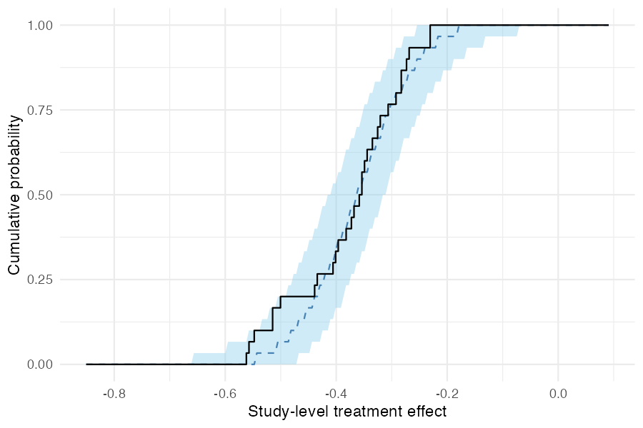
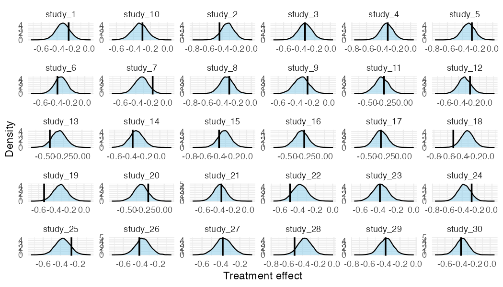

<!-- README.md is generated from README.Rmd. Please edit that file. -->

# metadid

[](https://github.com/ben18785/metadid/actions)
[](https://app.codecov.io/gh/ben18785/metadid)

**metadid** is an R package for Bayesian meta-analysis that synthesises
treatment effects across studies with different designs:
difference-in-differences (DiD), post-only randomised controlled trials
(RCT), and pre-post studies. It uses a hierarchical Stan model that
accounts for design-specific information and heterogeneity across
studies, with optional baseline normalisation to place outcomes on a
common fractional scale.

## Model assumptions

`metadid` assumes that all studies arise from a common latent
difference-in-differences (DiD) structure. Different study designs
correspond to observing different parts of this latent structure.

DiD studies are the only design in this framework that directly identify
the treatment effect. Meta-analyses that do not include DiD studies are
not identified from the data and depend entirely on modelling
assumptions. We do not recommend using this approach in the absence of
DiD evidence.

### Latent DiD model

For study $i$, outcomes in the **control group** satisfy

$$
\begin{pmatrix}
Y_{i,c,\mathrm{pre}} \\
Y_{i,c,\mathrm{post}}
\end{pmatrix}
\sim
\mathcal{N}
\left[
\begin{pmatrix}
\alpha_i \\
\alpha_i + \beta_i
\end{pmatrix}
,
\begin{pmatrix}
\sigma^2_{i,c,\mathrm{pre}} &
\rho_{i,c}\sigma_{i,c,\mathrm{pre}}\sigma_{i,c,\mathrm{post}} \\
\rho_{i,c}\sigma_{i,c,\mathrm{pre}}\sigma_{i,c,\mathrm{post}} &
\sigma^2_{i,c,\mathrm{post}}
\end{pmatrix}
\right],
$$

and outcomes in the **treatment group** satisfy

$$
\begin{pmatrix}
Y_{i,t,\mathrm{pre}} \\
Y_{i,t,\mathrm{post}}
\end{pmatrix}
\sim
\mathcal{N}
\left[
\begin{pmatrix}
\alpha_i + \gamma_i \\
\alpha_i + \gamma_i + \beta_i + \theta_i
\end{pmatrix}
,
\begin{pmatrix}
\sigma^2_{i,t,\mathrm{pre}} &
\rho_{i,t}\sigma_{i,t,\mathrm{pre}}\sigma_{i,t,\mathrm{post}} \\
\rho_{i,t}\sigma_{i,t,\mathrm{pre}}\sigma_{i,t,\mathrm{post}} &
\sigma^2_{i,t,\mathrm{post}}
\end{pmatrix}
\right].
$$

Here:

- $\alpha_i$: baseline mean in the control group  
- $\beta_i$: time trend shared across groups  
- $\gamma_i$: baseline difference between treatment and control  
- $\theta_i$: study-specific treatment effect  
- $\rho_{i,c}$, $\rho_{i,t}$: pre/post correlations  
- $\sigma_{i,g,\mathrm{pre}}$, $\sigma_{i,g,\mathrm{post}}$: marginal
  standard deviations

The key identifying assumption is that, in the absence of treatment, the
treatment group would have followed the same time trend $\beta_i$ as the
control group.

------------------------------------------------------------------------

### Study designs as partial observations

Different study designs correspond to observing subsets of this latent
structure:

- **DiD / RCT**: both groups and both time points observed  
- **Pre-post**: treatment group only  
- **Post-only / change-score**: partial observations of levels or
  differences

Inference for incomplete designs relies on the shared latent structure
across studies.

------------------------------------------------------------------------

### Hierarchical treatment effects

Study-specific treatment effects are modelled hierarchically, for
example as

$$
\theta_i \sim \mathcal{N}(\mu_\theta, \tau_\theta^2),
$$

where $\mu_\theta$ is the overall treatment effect and $\tau_\theta$
captures between-study heterogeneity.

For robustness to outlying study effects, the model can alternatively
use a Student-t distribution,

$$
\theta_i \sim t_\nu(\mu_\theta, \tau_\theta),
$$

where $\nu$ controls the tail-heaviness.

------------------------------------------------------------------------

### Individual-level and summary-level data

The model supports both:

- **individual-level data**, and  
- **summary statistics** (means, variances, sample sizes)

by deriving likelihoods from the same bivariate normal model.

------------------------------------------------------------------------

### Practical implication

Designs with missing components (e.g. pre-post) become informative by
borrowing structure from other studies, but this increases reliance on
the modelling assumptions above.

Post-only RCTs identify the sum of the treatment effect and any baseline
imbalance, while pre-post studies identify the sum of the treatment
effect and time trends. In the absence of DiD studies, separating these
components relies on modelling assumptions. While RCTs may be less
sensitive under randomisation assumptions, both designs provide only
partial identification of the treatment effect in this framework.

## Installation

metadid depends on [cmdstanr](https://mc-stan.org/cmdstanr/) and
[instantiate](https://CRAN.R-project.org/package=instantiate), which
compile Stan models at package install time. Install them first if you
haven’t already:

``` r
install.packages("cmdstanr", repos = c("https://mc-stan.org/r-packages/", getOption("repos")))
cmdstanr::install_cmdstan()

install.packages("instantiate")
```

Then install metadid from GitHub:

``` r
# install.packages("pak")
pak::pak("ben18785/metadid")
```

## Quick start

### 1. Simulate studies

`simulate_meta_did()` generates individual-level pre/post data for both
arms across a set of studies from a known hierarchical model.
`as_summary_did()` then aggregates this to the four-cell summary
statistics (pre/post × control/treatment) that represent what is
typically reported in a published study.

``` r
library(metadid)
#> 
#> Attaching package: 'metadid'
#> The following object is masked from 'package:base':
#> 
#>     gamma

sim <- simulate_meta_did(
  n_studies     = 20,
  true_effect   = -0.15,
  sigma_effect  = 0.03,
  baseline_mean = 0.45,
  rho           = 0.5,
  seed          = 42
)

studies <- as_summary_did(sim)
head(studies)
#> # A tibble: 6 × 13
#>   study_id design n_control n_treatment mean_pre_control mean_post_control
#>   <chr>    <chr>      <int>       <int>            <dbl>             <dbl>
#> 1 study_1  did          100         100            0.450             0.418
#> 2 study_10 did          100         100            0.448             0.435
#> 3 study_11 did          100         100            0.420             0.409
#> 4 study_12 did          100         100            0.475             0.444
#> 5 study_13 did          100         100            0.447             0.435
#> 6 study_14 did          100         100            0.461             0.416
#> # ℹ 7 more variables: sd_pre_control <dbl>, sd_post_control <dbl>,
#> #   mean_pre_treatment <dbl>, mean_post_treatment <dbl>,
#> #   sd_pre_treatment <dbl>, sd_post_treatment <dbl>, rho <dbl>
```

The true population treatment effect is `-0.15` on the raw scale, or
approximately -0.333 after normalising by the baseline mean of `0.45`.

### 2. Fit the model via optimisation

`meta_did()` fits a hierarchical Bayesian model. Setting
`method = "optimize"` finds the maximum a posteriori (MAP) estimate via
L-BFGS — this is faster than MCMC but provides no uncertainty measures
in estimates.

``` r
fit <- meta_did(
  summary_data = studies,
  method       = "optimize",
  seed         = 42
)

print(fit)
```

    #> Bayesian meta-analysis (metadid)
    #> Studies: DiD = 20 | RCT = 0 | Pre-Post = 0 | DiD (change only) = 0 
    #> Population treatment effect: -0.303  (MAP estimate, no uncertainty)

### 3. Inspect study-level estimates

`summary()` returns a data frame of population- and study-level
parameters. With MAP optimisation, only point estimates are available
(`sd`, `lo`, and `hi` are `NA`); use `method = "sample"` for full
posterior uncertainty.

``` r
summary(fit)
```

    #>                       parameter       mean sd lo hi
    #> 1         treatment_effect_mean -0.3032553 NA NA NA
    #> 2           treatment_effect_sd  0.2621790 NA NA NA
    #> 3  treatment_effect_did_summary -0.2626185 NA NA NA
    #> 4  treatment_effect_did_summary -0.4008142 NA NA NA
    #> 5  treatment_effect_did_summary -0.1788253 NA NA NA
    #> ...

### 4. Fit the model via MCMC

For full posterior uncertainty, use the default `method = "sample"`:

``` r
fit_mcmc <- meta_did(
  summary_data  = studies,
  seed          = 42,
  iter_warmup   = 200,
  iter_sampling = 400
)

print(fit_mcmc)
```

    #> Bayesian meta-analysis (metadid)
    #> Studies: DiD = 20 | RCT = 0 | Pre-Post = 0 | DiD (change only) = 0 
    #> Population treatment effect: -0.307  90% CI [-0.341, -0.273]

`summary()` now includes posterior standard deviations and credible
intervals:

``` r
summary(fit_mcmc)
```

    #>                       parameter        mean         sd          lo         hi
    #> 1         treatment_effect_mean -0.30734301 0.02053925 -0.34109011 -0.2731060
    #> 2           treatment_effect_sd  0.08387904 0.01614552  0.06170731  0.1124974
    #> 3  treatment_effect_did_summary -0.23482038 0.02605055 -0.27537815 -0.1916570
    #> 4  treatment_effect_did_summary -0.35087501 0.02539211 -0.39315193 -0.3085825
    #> 5  treatment_effect_did_summary -0.22512112 0.02910410 -0.27397179 -0.1791810
    #> ...

### 5. Posterior predictive checks

`pp_check_cdf(type = "summary")` compares the empirical CDF of observed
study-level treatment effects (step function) to the posterior
predictive CDF (ribbon and dashed median). If the model is
well-calibrated, the observed ECDF should track the predictive band.

``` r
pp_check_cdf(fit_mcmc, type = "summary")
```



For a more granular per-study view, `pp_check_effects()` shows each
study’s observed naive effect against its posterior predictive density:

``` r
pp_check_effects(fit_mcmc)
```


