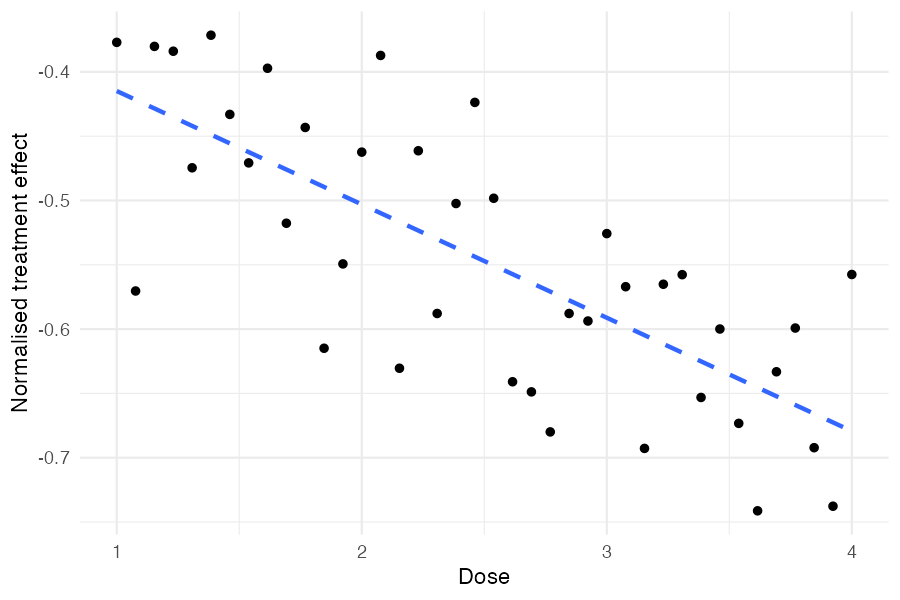
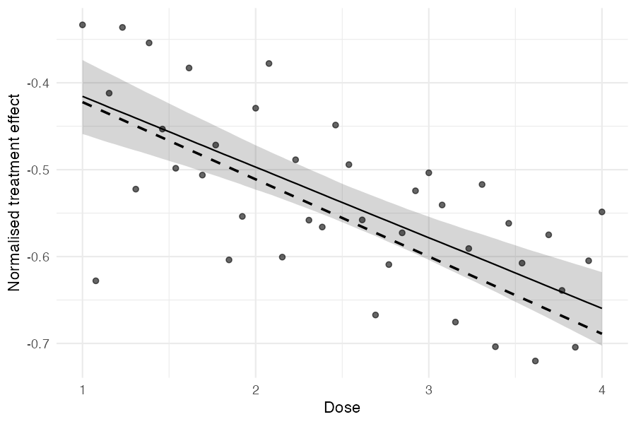

```{r setup, include = FALSE}
knitr::opts_chunk$set(
  collapse = TRUE,
  comment = "#>",
  fig.path = "figures/covariates-"
)
```

Treatment effects often vary systematically with study-level characteristics — for example, the dose of an intervention or the year a study was conducted. metadid supports **meta-regression** by letting you include study-level covariates that modify the population treatment effect. This vignette walks through simulating data from a model with a single continuous covariate (dose) and fitting the meta-regression to recover both the intercept and slope.

## Simulation

We simulate 40 studies where the true treatment effect depends linearly on a covariate called `dose`. Higher doses produce a more negative treatment effect:

$$\theta_i \sim \mathcal{N}(\mu_\theta + \beta \cdot \text{dose}_i,\; \sigma_\theta^2)$$

```{r simulate, eval = FALSE}
library(metadid)
library(dplyr)
library(ggplot2)

dose <- seq(1, 4, length.out = 40)

sim <- simulate_meta_did(
  n_studies     = 40,
  n_control     = 100,
  n_treatment   = 100,
  true_effect   = -0.15,
  sigma_effect  = 0.03,
  true_trend    = -0.02,
  sigma_trend   = 0.01,
  baseline_mean = 0.45,
  baseline_sd   = 0.02,
  rho           = 0.5,
  seed          = 6427,
  covariates    = data.frame(dose = dose),
  beta_cov      = -0.04
)
```

The `covariates` argument takes a data frame with one row per study, and `beta_cov` is a numeric vector of regression coefficients (one per covariate column). Here, each unit increase in dose shifts the raw treatment effect by -0.04.

## True dose–effect relationship

Before fitting any model, we can inspect the true simulated treatment effects. Each study has a known $\theta_i$ stored in the `true_params` attribute. Dividing by the study's baseline level puts these on the normalised scale that the model will estimate:

```{r dose-effect-true, eval = FALSE}
true_params <- attr(sim, "true_params")

params_with_dose <- true_params |>
  mutate(
    num = as.integer(gsub("study_", "", study_id)),
    dose = dose[num],
    normalised_effect = theta / baseline
  )

ggplot(params_with_dose, aes(x = dose, y = normalised_effect)) +
  geom_point() +
  geom_smooth(method = "lm", se = FALSE, linetype = "dashed") +
  labs(x = "Dose", y = "Normalised treatment effect") +
  theme_minimal()
```



Higher doses produce more negative treatment effects, as specified by `beta_cov = -0.04`. The scatter around the trend reflects `sigma_effect`, the between-study heterogeneity that remains after accounting for dose.

## Understanding the true parameter values

Because `meta_did()` expresses effects as fractions of each study's treatment-arm pre-treatment baseline (by default — `normalise = TRUE` performs this normalisation inside the Stan model rather than by dividing the data in R), the parameters the model estimates are on the normalised scale. With a baseline mean of 0.45 and no baseline imbalance in this simulation (so the treatment-arm and control-arm pre-baselines coincide on average):

- **True normalised slope:** $\beta / \bar{\alpha} = -0.04 / 0.45 \approx -0.089$
- **True normalised intercept at mean dose:** $(\mu_\theta + \beta \cdot \bar{d}) / \bar{\alpha} = (-0.15 + (-0.04) \times 2.5) / 0.45 \approx -0.556$

When `center_covariates = TRUE` (the default), `treatment_effect_mean` is the effect evaluated at the mean covariate value, not at dose = 0.

## Extracting summary data

We extract full DiD summary statistics from all 40 studies. The covariate column (`dose`) is carried through automatically:

```{r extract, eval = FALSE}
did_data <- as_summary_did(sim)

# Verify dose is present
did_data |>
  mutate(num = as.integer(gsub("study_", "", study_id))) |>
  arrange(num) |>
  select(study_id, design, dose) |>
  head()
```

```
#> # A tibble: 6 × 3
#>   study_id design  dose
#>   <chr>    <chr>  <dbl>
#> 1 study_1  did     1   
#> 2 study_2  did     1.08
#> 3 study_3  did     1.15
#> 4 study_4  did     1.23
#> 5 study_5  did     1.31
#> 6 study_6  did     1.38
```

## Fitting the meta-regression

Pass a one-sided formula to `covariates` to include the meta-regression term:

```{r fit, eval = FALSE}
fit <- meta_did(
  summary_data = did_data,
  covariates   = ~ dose,
  seed         = 8153
)

print(fit)
```

```
#> Bayesian meta-analysis (metadid)
#> Studies: DiD = 40 | RCT = 0 | Pre-Post = 0 | DiD (change only) = 0 
#> Population treatment effect: -0.538  90% CI [-0.560, -0.516]
#> Covariate coefficients:
#>   dose: -0.081  90% CI [-0.105, -0.057]
#>   (covariates were mean-centered; treatment_effect_mean is the effect at covariate means)
```

Both the intercept (treatment effect at mean dose) and the slope are recovered, with the true normalised values (-0.556 and -0.089) falling within the 90% credible intervals.

## Inspecting the posterior

We can look at the full summary, including study-level treatment effects:

```{r summary, eval = FALSE}
te <- summary(fit)
te[te$parameter %in% c("treatment_effect_mean", "treatment_effect_sd",
                        "beta_cov[dose]"), ]
```

```
#>               parameter   mean    sd     lo     hi
#> 1 treatment_effect_mean -0.538 0.014 -0.560 -0.516
#> 2   treatment_effect_sd  0.077 0.010  0.061  0.095
#> 3        beta_cov[dose] -0.081 0.015 -0.105 -0.057
```

The residual between-study SD (`treatment_effect_sd`) represents the heterogeneity remaining after accounting for dose.

## Estimated dose–effect relationship

A useful diagnostic is to plot the observed study-level treatment effects against the covariate and overlay the estimated regression line with uncertainty:

```{r dose-effect-plot, eval = FALSE}
# Compute naive normalised effect per study
naive_effects <- did_data |>
  mutate(
    norm = mean_pre_control,
    naive_effect = (mean_post_treatment - mean_pre_treatment) / norm -
                   (mean_post_control - mean_pre_control) / norm
  )

# Posterior draws for regression line
beta_draws <- as.numeric(
  fit$fit$draws("beta_cov", format = "draws_matrix")
)
intercept_draws <- as.numeric(
  fit$fit$draws("treatment_effect_mean", format = "draws_matrix")
)

# Covariates were centered; reconstruct on original dose scale
dose_center <- fit$cov_centers[["dose"]]
dose_grid <- seq(min(dose), max(dose), length.out = 100)

# Each draw gives a line: intercept + beta * (dose - center)
line_df <- expand.grid(
  dose = dose_grid,
  draw = seq_along(beta_draws)
) |>
  mutate(
    fitted = intercept_draws[draw] + beta_draws[draw] * (dose - dose_center)
  ) |>
  group_by(dose) |>
  summarise(
    median = median(fitted),
    lo     = quantile(fitted, 0.05),
    hi     = quantile(fitted, 0.95),
    .groups = "drop"
  )

# True regression line on the normalised scale
true_line_df <- data.frame(dose = range(dose)) |>
  mutate(true_effect = (-0.15 + -0.04 * dose) / 0.45)

ggplot() +
  geom_ribbon(data = line_df, aes(x = dose, ymin = lo, ymax = hi),
              alpha = 0.2) +
  geom_line(data = line_df, aes(x = dose, y = median)) +
  geom_line(data = true_line_df, aes(x = dose, y = true_effect),
            linetype = "dashed", linewidth = 0.8) +
  geom_point(data = naive_effects, aes(x = dose, y = naive_effect),
             alpha = 0.6) +
  labs(x = "Dose", y = "Normalised treatment effect") +
  theme_minimal()
```



The points are naive study-level estimates, the solid line is the posterior median regression with a 90% credible band, and the dashed line is the true data-generating relationship.

## Posterior predictive checks

The standard posterior predictive checks work with covariate models. The model-implied predictive distribution for each study accounts for its dose level:

```{r pp-check, eval = FALSE}
pp_check_cdf(fit, type = "summary")
```

## Mixed designs with covariates

Covariates work with mixed-design meta-analyses too. For example, if some studies are RCTs and others are DiD, just ensure the covariate column is present in all rows of the combined summary data:

```{r mixed-covariates, eval = FALSE}
study_ids <- unique(sim$study_id)
true_params <- attr(sim, "true_params")

sim_did <- sim |> filter(study_id %in% study_ids[1:20])
sim_rct <- sim |> filter(study_id %in% study_ids[21:40])

attr(sim_did, "true_params") <- true_params |> filter(study_id %in% study_ids[1:20])
attr(sim_rct, "true_params") <- true_params |> filter(study_id %in% study_ids[21:40])

mixed_data <- bind_rows(
  as_summary_did(sim_did),
  as_summary_rct(sim_rct)
)

fit_mixed <- meta_did(
  summary_data = mixed_data,
  covariates   = ~ dose,
  seed         = 8153
)

print(fit_mixed)
```

```
#> Bayesian meta-analysis (metadid)
#> Studies: DiD = 20 | RCT = 20 | Pre-Post = 0 | DiD (change only) = 0 
#> Population treatment effect: -0.544  90% CI [-0.567, -0.522]
#> Covariate coefficients:
#>   dose: -0.086  90% CI [-0.111, -0.060]
#>   (covariates were mean-centered; treatment_effect_mean is the effect at covariate means)
```

The credible intervals are somewhat wider with mixed designs, but both the intercept and slope are still recovered.

## Multiplicative covariates

The covariates discussed so far enter the treatment-effect model *additively*: each unit change in `dose` shifts the expected effect by a fixed amount. Sometimes a covariate is better described as *scaling* the effect — multiplying it by a factor rather than shifting it. A common motivating example: experimental ("artificial") settings often produce larger effect sizes than real-world deployments, and we'd like to estimate how much the real-world effect is attenuated relative to the experimental one, jointly with the experimental effect itself.

metadid supports this through the `multiplicative_covariate` argument. The covariate is categorical with a reference level: one `multiplier` is estimated per non-reference level and applied to the studies at that level, while the reference level's factor is fixed at 1. A two-level indicator $m_i \in \{0, 1\}$ is the simplest case, with a single estimated `multiplier` applied to the studies where it equals 1:

$$\mu_i = \begin{cases} \mu_\theta + X_{\mathrm{cov},i}^{\top}\beta_{\mathrm{cov}} & m_i = 0 \\ \mathrm{multiplier} \cdot \bigl(\mu_\theta + X_{\mathrm{cov},i}^{\top}\beta_{\mathrm{cov}}\bigr) & m_i = 1. \end{cases}$$

Studies with $m_i = 0$ identify the linear predictor directly; studies with $m_i = 1$ see it multiplied by the `multiplier`. The multiplier is strictly positive, with a log-normal `lognormal(0, 0.7)` prior: a median of 1 (the no-effect case, where every study contributes to the same population mean) and no boundary at zero, so a small attenuating multiplier is not pushed up against a hard limit. The prior is placed on $\log(\mathrm{multiplier})$, so the factor is symmetric in "halving" versus "doubling".

### Example: experimental vs real-world studies

We build an illustrative summary data frame of 30 DiD studies in three settings
(10 each): an experimental batch and two real-world batches whose true effects
are attenuated relative to it. Each study is tagged with its `setting`.

```{r mult-setup, eval = FALSE}
make_batch <- function(effect, setting, seed) {
  sim <- simulate_meta_did(
    n_studies = 10, n_control = 100, n_treatment = 100,
    true_effect = effect, sigma_effect = 0.05,
    true_trend = 0, baseline_mean = 0.45, seed = seed
  )
  sim$study_id <- paste0(setting, "_", sim$study_id)  # keep IDs unique across batches
  out <- as_summary_did(sim)
  out$setting <- setting
  out
}

studies <- rbind(
  make_batch(-0.41, "experimental", 11),
  make_batch(-0.27, "rw_lab",       22),
  make_batch(-0.14, "rw_field",     33)
)
```

A first pass collapses the two real-world settings into a single `{0, 1}`
indicator, estimating one multiplier for "any real-world" relative to
experimental:

```{r mult-example, eval = FALSE}
studies$real_world <- ifelse(studies$setting == "experimental", 0, 1)

fit <- meta_did(
  summary_data             = studies,
  multiplicative_covariate = "real_world",
  priors = set_priors(
    multiplier = lognormal(0, 0.7)
  ),
  seed = 9931
)

print(fit)
```

```
#> Bayesian meta-analysis (metadid)
#> Studies: DiD = 30 | RCT = 0 | Pre-Post = 0 | DiD (change only) = 0
#> Population treatment effect: -0.410  90% CI [-0.450, -0.372]
#> Multiplicative covariate (real_world):
#>   0: 1  (reference)
#>   1: 0.503  90% CI [0.412, 0.598]
```

The reference level (`0`, experimental) is fixed at 1. The interpretation:
experimental studies produce an effect around -0.41, while real-world studies
produce roughly half of that (multiplier ≈ 0.50). The combination yields the
per-study mean used in the meta-analysis.

### Identifiability

A multiplicative covariate is only identifiable when the data contain variation in both directions. `meta_did()` enforces this with two checks:

* **Hard error: constant indicator.** If every study has $m_i = 0$ or every study has $m_i = 1$, then $\mu_\theta$ and the `multiplier` are jointly unidentified — any pair with the same product gives identical likelihood. `meta_did()` stops with an error pointing to the column.
* **Soft warning: collinearity with an additive covariate.** If `multiplicative_covariate` is nearly perfectly correlated with one of the `covariates` (`|cor| > 0.95`), the multiplier and that covariate's coefficient will be weakly identified. The model still runs but the posterior correlation between them will be high. A warning is issued so you can investigate before trusting the result.

### Categorical multiplicative covariates

The covariate is not restricted to a two-level indicator. With a column such as
`setting` taking the values `experimental`, `rw_lab`, and `rw_field`, one
multiplier is estimated for each non-reference level:

```{r mult-categorical, eval = FALSE}
studies$setting <- factor(studies$setting,
                          levels = c("experimental", "rw_lab", "rw_field"))
fit <- meta_did(
  summary_data             = studies,
  multiplicative_covariate = "setting"
)
summary(fit)
```

```
#>                     parameter   mean    sd     lo     hi
#> 1       treatment_effect_mean -0.410 0.019 -0.442 -0.379
#> 2         treatment_effect_sd  0.052 0.011  0.036  0.072
#> 3   effect_multiplier[rw_lab]  0.659 0.071  0.548  0.781
#> 4 effect_multiplier[rw_field]  0.341 0.058  0.252  0.443
```

Each non-reference level gets its own row, labelled `effect_multiplier[<level>]`
(the same name `print()` uses): the lab setting retains about two-thirds of the
experimental effect, the field setting about a third. The reference level
(`experimental`) is fixed at 1 and is not shown as a row.

The reference is the first factor level — declare the column as a factor to
control it, with identical levels declared in every data frame. For numeric
input the levels sort in ascending order (so a `{0, 1}` indicator makes 0 the
reference and 1 the single non-reference level), and for character input
alphabetically. The same `multiplier` prior from `set_priors()` is applied
independently to each estimated factor, and the data must contain studies at
two or more levels for the multipliers to be identified.

### Two multiplicative covariates (a product of factors)

A single fit may carry up to **two** multiplicative covariates. Pass a one-sided
formula naming both columns; each is estimated independently and a study's
overall multiplier is the **product** of the two per-covariate factors,
$\alpha_{a(i)} \cdot \beta_{b(i)}$. This suits a design where the effect is
scaled by two distinct study attributes at once — for example an
experimental-vs-real-world factor crossed with a delivery-format factor.

```{r mult-two, eval = FALSE}
# Two independent study attributes, each scaling the effect multiplicatively.
studies$arm    <- rep(c("experimental", "real_world"), length.out = nrow(studies))
studies$format <- rep(c("digital", "leaflet"),         length.out = nrow(studies))

fit <- meta_did(
  summary_data             = studies,
  multiplicative_covariate = ~ arm + format,
  priors = set_priors(multiplier = lognormal(0, 0.7))
)
summary(fit)
```

```
#>                           parameter   mean    sd     lo     hi
#> 1             treatment_effect_mean -0.410 0.020 -0.443 -0.377
#> 2               treatment_effect_sd  0.055 0.011  0.039  0.075
#> 3 effect_multiplier[arm:real_world]  0.620 0.082  0.498  0.761
#> 4 effect_multiplier[format:leaflet]  0.810 0.099  0.659  0.985
```

Each factor's reference level (`experimental` for `arm`, `digital` for `format`,
both alphabetically first) is fixed at 1, so the rows report the remaining
levels. Here the real-world arm retains about 62% of the experimental effect and
the leaflet format about 81% of the digital one; a real-world leaflet study is
scaled by the product (≈ 0.62 × 0.81 ≈ 0.50). With two covariates the summary
rows are prefixed by the covariate name to disambiguate them. At most two
multiplicative covariates are supported.

### When to use a multiplicative vs additive covariate

The two parameterisations encode different beliefs about the world:

* Use **additive** when each study's effect is shifted by a fixed amount linked to the covariate, with the same shift size regardless of the underlying effect's magnitude.
* Use **multiplicative** when the covariate attenuates or amplifies the underlying effect — e.g. a real-world implementation that captures a fraction of what an experiment showed, and a stronger experimental effect would also produce a proportionally stronger real-world effect.

The choice matters most for prediction at unobserved covariate values: under the multiplicative model, the predicted real-world effect tracks the experimental effect's posterior; under the additive model it differs by a fixed offset.

A multiplicative covariate can be combined with one or more additive covariates in the same fit — provided they are not collinear with each other, as flagged above.

