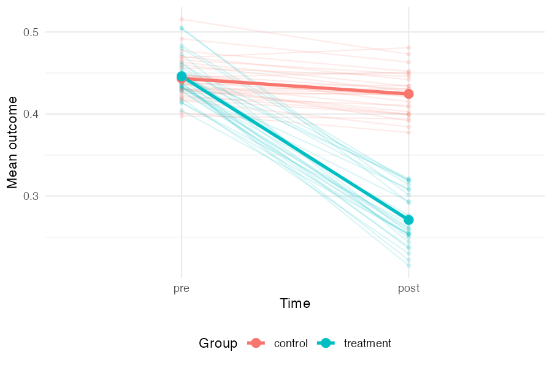
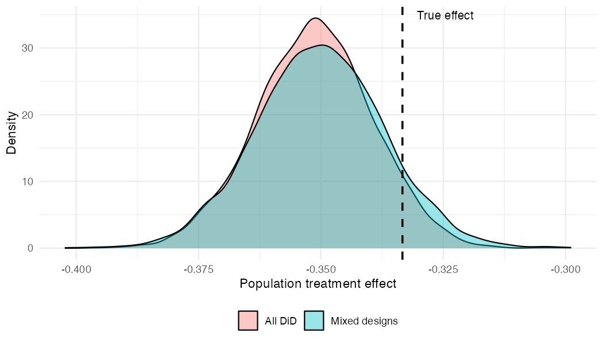
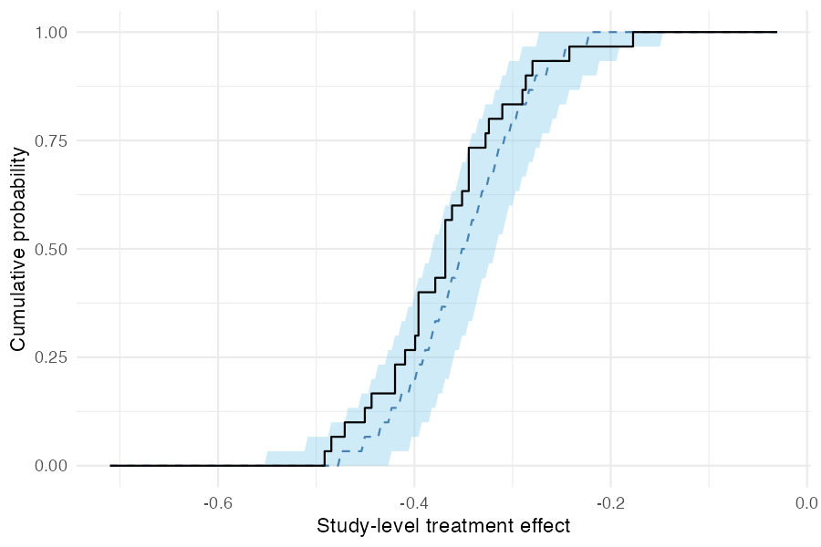
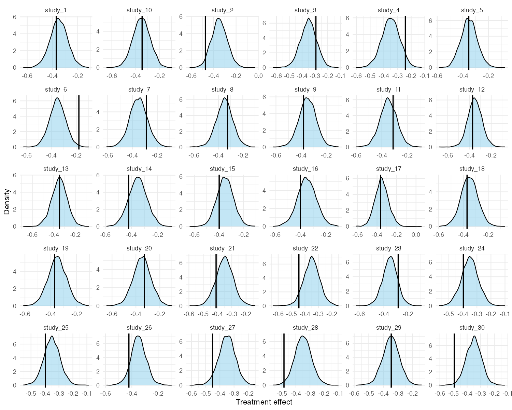

```{r setup, include = FALSE}
knitr::opts_chunk$set(
  collapse = TRUE,
  comment = "#>",
  fig.path = "figures/mixed-designs-"
)
```

In practice, a literature review often turns up studies with very different designs. Some may be full difference-in-differences studies reporting pre/post outcomes for both treatment and control groups; others may be RCTs reporting only post-treatment outcomes; others may be single-arm pre-post studies with no control group at all.

metadid's core assumption is that all of these designs are partial views of the same underlying DiD process. This vignette demonstrates that, even when studies provide very different amounts of information, the model can recover the true population treatment effect.

## Simulation setup

We simulate 30 studies from a known hierarchical DiD model:

```{r simulate, eval = FALSE}
library(metadid)
library(dplyr)
library(ggplot2)

sim <- simulate_meta_did(
  n_studies     = 30,
  n_control     = 80,
  n_treatment   = 80,
  true_effect   = -0.15,
  sigma_effect  = 0.03,
  true_trend    = -0.02,
  sigma_trend   = 0.01,
  baseline_mean = 0.45,
  baseline_sd   = 0.02,
  rho           = 0.5,
  seed          = 4718
)
```

The true population treatment effect is -0.15 on the raw scale. With baseline normalisation (the default), this corresponds to approximately -0.333 on the normalised scale.

## Visualising the latent DiD structure

Before fitting any models, it is useful to see the data-generating process directly. The plot below shows each study as a pair of faint lines (control and treatment group means from pre to post), with the grand mean overlaid in bold. The treatment group starts at roughly the same level as the control group but drops much further — the gap between the two bold slopes is the treatment effect. The spread of the faint lines reflects between-study heterogeneity.

```{r spaghetti, eval = FALSE, fig.width = 6, fig.height = 4}
study_means <- sim |>
  group_by(study_id, group, time) |>
  summarise(mean_value = mean(value), .groups = "drop") |>
  mutate(time = factor(time, levels = c("pre", "post")))

grand_means <- study_means |>
  group_by(group, time) |>
  summarise(mean_value = mean(mean_value), .groups = "drop")

ggplot(study_means, aes(x = time, y = mean_value, colour = group,
                        group = interaction(study_id, group))) +
  geom_line(alpha = 0.15) +
  geom_point(alpha = 0.15, size = 1) +
  geom_line(data = grand_means, aes(group = group), linewidth = 1.2) +
  geom_point(data = grand_means, aes(group = group), size = 3) +
  labs(x = "Time", y = "Mean outcome", colour = "Group") +
  theme_minimal() +
  theme(legend.position = "bottom")
```



## Two scenarios

We compare two ways of using the same underlying data.

### Scenario A: all studies treated as DiD

In the best case, every study provides full four-cell summary statistics (pre/post × control/treatment). This gives the model maximum information per study.

```{r all-did, eval = FALSE}
all_did <- as_summary_did(sim)

fit_all_did <- meta_did(
  summary_data  = all_did,
  seed          = 4718
)

print(fit_all_did)
```

```
#> Bayesian meta-analysis (metadid)
#> Studies: DiD = 30 | RCT = 0 | Pre-Post = 0 | DiD (change only) = 0 
#> Population treatment effect: -0.351  90% CI [-0.371, -0.332]
```

### Scenario B: mixed designs

Now suppose that, from the same underlying data, only a third of studies provide full DiD information. Another third are RCTs (post-treatment outcomes only), and the remaining third are pre-post studies (treatment arm only, no control group).

```{r mixed, eval = FALSE}
study_ids <- unique(sim$study_id)
did_ids <- study_ids[1:10]
rct_ids <- study_ids[11:20]
pp_ids  <- study_ids[21:30]

# Preserve true_params for subsetting
true_params <- attr(sim, "true_params")

sim_did <- sim |> filter(study_id %in% did_ids)
sim_rct <- sim |> filter(study_id %in% rct_ids)
sim_pp  <- sim |> filter(study_id %in% pp_ids)

attr(sim_did, "true_params") <- true_params |> filter(study_id %in% did_ids)
attr(sim_rct, "true_params") <- true_params |> filter(study_id %in% rct_ids)
attr(sim_pp, "true_params")  <- true_params |> filter(study_id %in% pp_ids)

mixed <- bind_rows(
  as_summary_did(sim_did),
  as_summary_rct(sim_rct),
  as_summary_pp(sim_pp)
)

fit_mixed <- meta_did(
  summary_data = mixed,
  seed         = 4718
)

print(fit_mixed)
```

```
#> Bayesian meta-analysis (metadid)
#> Studies: DiD = 10 | RCT = 10 | Pre-Post = 10 | DiD (change only) = 0 
#> Population treatment effect: -0.350  90% CI [-0.372, -0.328]
```

## Comparing posteriors

Both fits recover the true normalised effect (-0.333, dashed line). The mixed-design posterior is slightly wider, reflecting the information lost by having two-thirds of the studies provide incomplete data — but the difference is modest.

```{r comparison, eval = FALSE}
draws_did <- as.numeric(
  fit_all_did$fit$draws("treatment_effect_mean", format = "draws_matrix")
)
draws_mix <- as.numeric(
  fit_mixed$fit$draws("treatment_effect_mean", format = "draws_matrix")
)

comp_df <- data.frame(
  value = c(draws_did, draws_mix),
  scenario = rep(c("All DiD", "Mixed designs"), each = length(draws_did))
)

ggplot(comp_df, aes(x = value, fill = scenario)) +
  geom_density(alpha = 0.4) +
  geom_vline(xintercept = -0.15 / 0.45, linetype = "dashed", linewidth = 0.8) +
  annotate("text", x = -0.15 / 0.45 + 0.003, y = Inf, label = "True effect",
           hjust = 0, vjust = 1.5, size = 3.5) +
  labs(x = "Population treatment effect", y = "Density", fill = NULL) +
  theme_minimal() +
  theme(legend.position = "bottom")
```



The key takeaway: by assuming a common latent DiD structure, the model borrows strength across designs. RCT and pre-post studies contribute meaningful information about the treatment effect, even though they each observe less of the underlying process than a full DiD study.

## Posterior predictive checks

### Study-level effects

As a calibration check, `pp_check_cdf(type = "summary")` compares the empirical CDF of observed study-level treatment effects (step function) to the posterior predictive CDF (ribbon and dashed median). If the model is well-specified, the observed ECDF should fall within the predictive band.

```{r pp-check-cdf, eval = FALSE}
pp_check_cdf(fit_mixed, type = "summary")
```



### Per-study densities

For a more granular view, `pp_check_effects()` shows each study's observed naive treatment effect (vertical line) against the posterior predictive density for that study. This is useful for identifying individual studies that the model struggles to explain.

```{r pp-check-effects, eval = FALSE}
pp_check_effects(fit_mixed)
```


